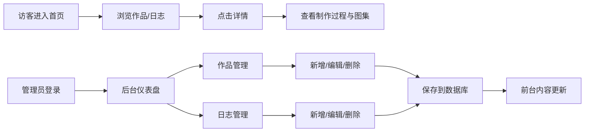

## 1. 产品概述

手工艺人个人工作室博客网站——以"安静的个人工作室"为视觉基调，展示手作作品档案与制作日志，同时提供完整的后台管理系统用于内容创作与维护。

- 目标用户：手工艺创作者、手作爱好者、潜在客户
- 核心价值：高质量的作品展示 + 真诚的制作过程记录 + 便捷的内容管理

## 2. 核心功能

### 2.1 用户角色

| 角色 | 注册方式 | 核心权限 |
|------|----------|----------|
| 访客 | 无需注册 | 浏览作品、阅读日志、查看关于页 |
| 管理员 | 预设账号登录 | 登录后台、管理作品、管理日志、内容发布 |

### 2.2 功能模块

1. **前台展示**：首页、作品列表、作品详情、日志列表、日志详情、关于页
2. **后台管理**：登录、仪表盘、作品 CRUD、日志 CRUD、分类管理
3. **内容系统**：Markdown 内容渲染、作品图集、材料/工具标签

### 2.3 页面详情

| 页面名称 | 模块名称 | 功能描述 |
|----------|----------|----------|
| 首页 | Hero 区域 | 品牌标语 + 精选作品大图，优雅的入场动画 |
| 首页 | 精选作品 | 展示 3-4 件精选作品卡片，hover 微动效 |
| 首页 | 最新日志 | 展示 2-3 篇最新制作日志摘要 |
| 首页 | 工作室一瞥 | 关于工作室的简短介绍与入口 |
| 作品列表页 | 分类筛选 | 按工艺分类（木作/陶瓷/织物等）筛选作品 |
| 作品列表页 | 作品网格 | 响应式网格布局展示所有作品卡片 |
| 作品详情页 | 作品主图 | 大幅封面图，保持图片真实色彩 |
| 作品详情页 | 作品信息 | 标题、日期、材料、工具、简介 |
| 作品详情页 | 制作过程 | Markdown 渲染的详细制作步骤 |
| 作品详情页 | 作品图集 | 多图画廊展示成品与过程 |
| 日志列表页 | 日志列表 | 按时间倒序展示制作日志卡片 |
| 日志详情页 | 日志正文 | Markdown 渲染的完整日志内容 |
| 关于页 | 作者介绍 | 个人/工作室介绍、理念、联系方式 |
| 后台登录页 | 登录表单 | 用户名/密码登录，错误提示 |
| 后台仪表盘 | 数据概览 | 作品数量、日志数量、最近发布 |
| 后台作品管理 | 作品列表 | 搜索、筛选、分页、编辑/删除操作 |
| 后台作品编辑 | 编辑表单 | 富文本/Markdown 编辑、图片上传、字段编辑 |
| 后台日志管理 | 日志列表 | 搜索、分页、编辑/删除操作 |
| 后台日志编辑 | 编辑表单 | 标题、内容、封面编辑 |

## 3. 核心流程

### 访客浏览流程
访客进入首页 → 浏览精选作品 → 点击进入作品详情 → 查看制作过程与图集 → 返回浏览更多作品或日志

### 管理员内容管理流程
管理员访问登录页 → 输入账号密码 → 进入仪表盘 → 选择作品/日志管理 → 新增/编辑内容 → 保存发布 → 前台实时更新

## 4. 用户界面设计

### 4.1 设计风格

**视觉基调：安静的个人工作室 / 编辑风 / 克制的手工感**

- **主色调**：低饱和度灰蓝（#506A73）+ 鼠尾草绿（#7A8B7A）+ 米白底色（#F4F5F5）
- **辅助色**：深炭灰文字（#273238）、中灰辅助文字（#68777C）、浅灰边框（#D7DEDF）
- **按钮风格**：极简细线边框、微圆角、hover 时底色柔和过渡，无强阴影
- **字体**：衬线体用于标题（体现手工艺质感），无衬线体用于正文（保证可读性）
- **布局风格**：大量留白、克制的分隔线、非对称的图文编排、编辑式排版
- **图标风格**：简约线性图标，或纯文字导航

### 4.2 页面设计概览

| 页面名称 | 模块名称 | UI 元素 |
|----------|----------|---------|
| 首页 | Hero 区域 | 左侧大标题 + 衬线字体，右侧精选作品大图，底部微妙渐变遮罩 |
| 首页 | 作品卡片 | 方形封面图 + 标题 + 分类标签，hover 时图片微放大 + 显示简介 |
| 作品详情页 | 主图区 | 全宽大图，下方信息条（日期/材料/工具） |
| 作品详情页 | 制作过程 | 左图右文交替排版，步骤编号衬线字体 |
| 后台管理 | 侧边栏 + 内容区 | 左侧极简导航，右侧白色内容卡片，表格布局 |
| 后台管理 | 表单 | 左侧标签 + 右侧输入框，简洁边框，聚焦时细线高亮 |

### 4.3 响应式

- **设计方式**：桌面端优先，移动端适配
- **断点**：移动端（< 768px）、平板（768-1024px）、桌面（> 1024px）
- **移动端适配**：导航折叠为汉堡菜单、作品网格变单列、图片全宽显示、字号适当缩小
- **触控优化**：按钮最小触控区域 44px，链接间距合理

### 4.4 动效与交互

- 页面入场：元素渐入 + 轻微上移，错峰出现
- 作品卡片 hover：图片 1.03 倍缩放 + 透明度微调
- 导航：下划线从左至右滑入
- 后台侧边栏：当前页高亮，平滑过渡
- 图片加载：模糊占位 → 清晰图片的淡入效果
