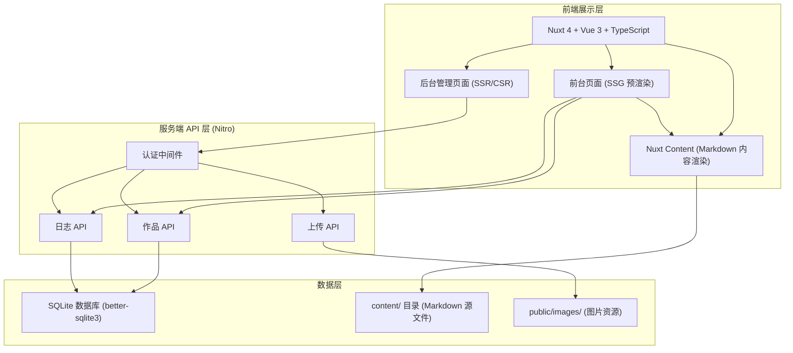
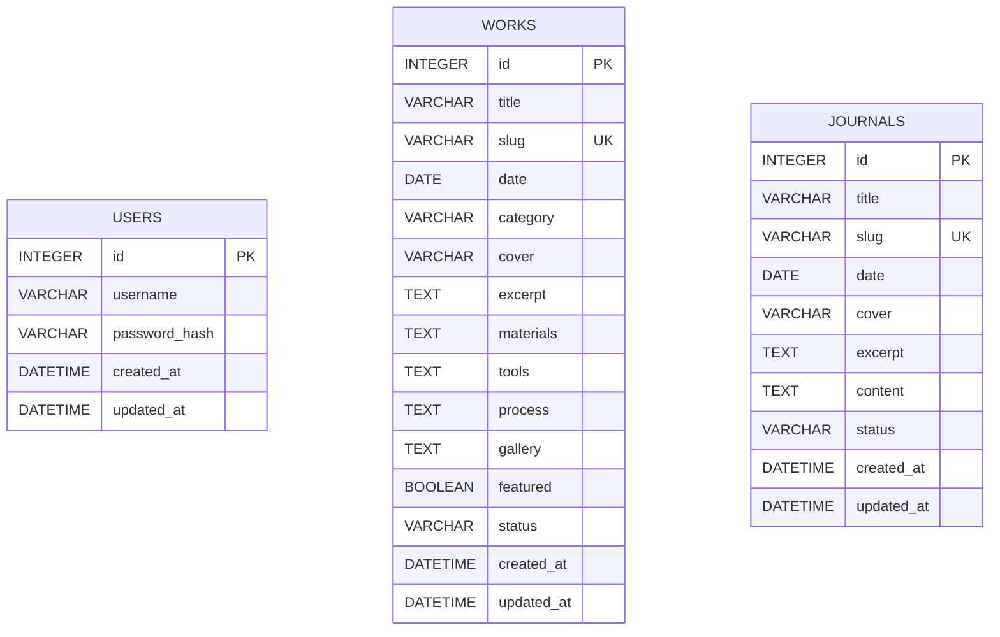
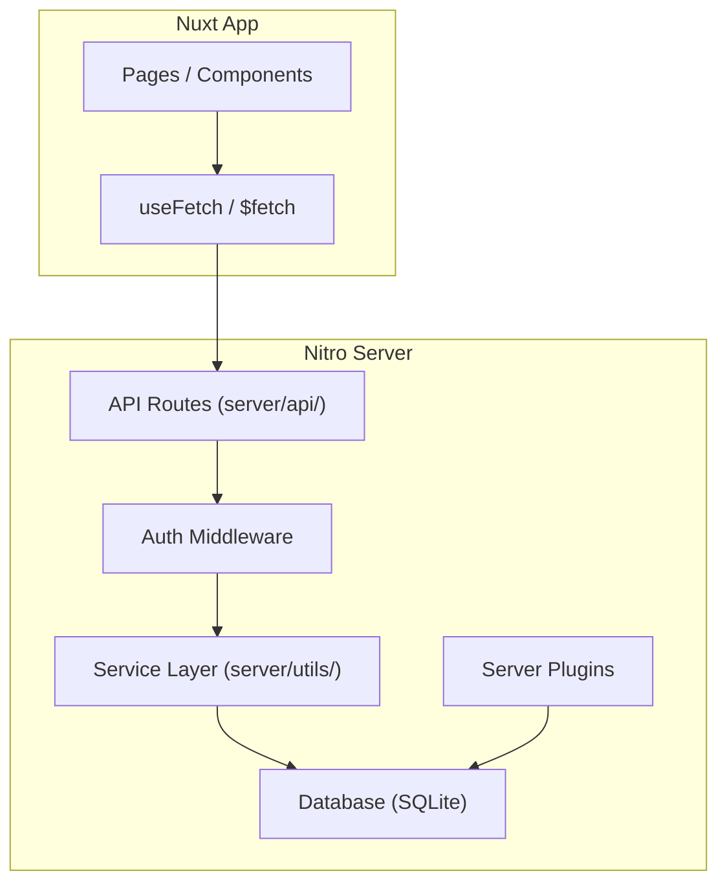

## 1. 架构设计



## 2. 技术描述

- **前端框架**：Nuxt 4 + Vue 3 + TypeScript
- **UI 层**：Vue 3 Composition API + `<script setup lang="ts">`
- **内容管理**：@nuxt/content（Markdown 内容驱动）
- **渲染策略**：前台页面 SSG 预渲染，后台管理页 SSR/CSR
- **样式方案**：原生 CSS + CSS 自定义属性（Design Tokens）+ CSS Modules
- **服务端**：Nitro（Nuxt 内置）
- **数据库**：SQLite（better-sqlite3），轻量文件型数据库
- **认证方式**：Session + Cookie（nuxt-auth 或自建简单认证）
- **Markdown 渲染**：Nuxt Content 内置
- **部署方式**：SSG 输出 `.output/public` 可静态部署，动态部分用 Node 服务

## 3. 目录结构

```
project-root/
├─ app/
│  ├─ app.vue
│  ├─ pages/
│  │  ├─ index.vue                 # 首页
│  │  ├─ works/
│  │  │  ├─ index.vue              # 作品列表
│  │  │  └─ [slug].vue             # 作品详情
│  │  ├─ journal/
│  │  │  ├─ index.vue              # 日志列表
│  │  │  └─ [...slug].vue          # 日志详情
│  │  ├─ about.vue                 # 关于页
│  │  └─ admin/
│  │     ├─ login.vue              # 后台登录
│  │     ├─ index.vue              # 仪表盘
│  │     ├─ works/
│  │     │  ├─ index.vue           # 作品管理列表
│  │     │  ├─ new.vue             # 新建作品
│  │     │  └─ [id].vue            # 编辑作品
│  │     └─ journal/
│  │        ├─ index.vue           # 日志管理列表
│  │        ├─ new.vue             # 新建日志
│  │        └─ [id].vue            # 编辑日志
│  ├─ components/
│  │  ├─ site/                     # 全站组件
│  │  │  ├─ SiteHeader.vue
│  │  │  └─ SiteFooter.vue
│  │  ├─ works/                    # 作品相关
│  │  │  ├─ WorkCard.vue
│  │  │  ├─ WorkGallery.vue
│  │  │  └─ ProcessStep.vue
│  │  ├─ journal/                  # 日志相关
│  │  │  └─ JournalCard.vue
│  │  └─ admin/                    # 后台组件
│  │     ├─ AdminLayout.vue
│  │     ├─ AdminSidebar.vue
│  │     └─ DataTable.vue
│  ├─ layouts/
│  │  └─ default.vue
│  ├─ composables/
│  │  ├─ useAuth.ts                # 认证状态
│  │  └─ useWorks.ts               # 作品数据
│  ├─ assets/
│  │  └─ css/
│  │     ├─ tokens.css             # 设计变量
│  │     ├─ globals.css            # 全局样式
│  │     └─ typography.css         # 排版系统
│  └─ utils/
│     └─ format.ts
├─ content/                        # Nuxt Content 内容目录
│  ├─ works/
│  └─ journal/
├─ public/
│  ├─ images/
│  ├─ favicon.svg
│  └─ robots.txt
├─ server/
│  ├─ api/
│  │  ├─ auth/
│  │  │  ├─ login.post.ts
│  │  │  └─ logout.post.ts
│  │  ├─ works/
│  │  │  ├─ index.get.ts
│  │  │  ├─ index.post.ts
│  │  │  ├─ [id].get.ts
│  │  │  ├─ [id].put.ts
│  │  │  └─ [id].delete.ts
│  │  └─ journal/
│  │     ├─ index.get.ts
│  │     ├─ index.post.ts
│  │     ├─ [id].get.ts
│  │     ├─ [id].put.ts
│  │     └─ [id].delete.ts
│  ├─ middleware/
│  │  └─ auth.ts                   # 认证中间件
│  ├─ utils/
│  │  └─ db.ts                     # SQLite 数据库实例
│  └─ plugins/
│     └─ initDB.ts                 # 数据库初始化
├─ shared/
│  └─ types.ts                     # 前后端共享类型
├─ nuxt.config.ts
├─ package.json
└─ tsconfig.json
```

## 4. 路由定义

| 路由 | 用途 | 渲染方式 |
|------|------|----------|
| `/` | 首页 | SSG |
| `/works` | 作品列表 | SSG |
| `/works/[slug]` | 作品详情 | SSG |
| `/journal` | 日志列表 | SSG |
| `/journal/[...slug]` | 日志详情 | SSG |
| `/about` | 关于页 | SSG |
| `/admin/login` | 后台登录 | SSR |
| `/admin` | 后台仪表盘 | SSR (需认证) |
| `/admin/works` | 作品管理列表 | SSR (需认证) |
| `/admin/works/new` | 新建作品 | SSR (需认证) |
| `/admin/works/[id]` | 编辑作品 | SSR (需认证) |
| `/admin/journal` | 日志管理列表 | SSR (需认证) |
| `/admin/journal/new` | 新建日志 | SSR (需认证) |
| `/admin/journal/[id]` | 编辑日志 | SSR (需认证) |

## 5. API 定义

### 5.1 认证接口

```typescript
// POST /api/auth/login
interface LoginRequest {
  username: string
  password: string
}

interface LoginResponse {
  success: boolean
  user: { id: number; username: string }
}

// POST /api/auth/logout
interface LogoutResponse {
  success: boolean
}
```

### 5.2 作品接口

```typescript
interface Work {
  id: number
  title: string
  slug: string
  date: string
  category: string
  cover: string
  excerpt: string
  materials: string[]
  tools: string[]
  process: string
  gallery: string[]
  featured: boolean
  status: 'draft' | 'published'
  createdAt: string
  updatedAt: string
}

// GET /api/works?page=1&limit=10&category=wood
interface WorksListResponse {
  items: Work[]
  total: number
  page: number
  limit: number
}

// GET /api/works/[id]
// Response: Work

// POST /api/works
// Request: Omit<Work, 'id' | 'createdAt' | 'updatedAt'>
// Response: Work

// PUT /api/works/[id]
// Request: Partial<Work>
// Response: Work

// DELETE /api/works/[id]
// Response: { success: boolean }
```

### 5.3 日志接口

```typescript
interface Journal {
  id: number
  title: string
  slug: string
  date: string
  cover: string
  excerpt: string
  content: string
  status: 'draft' | 'published'
  createdAt: string
  updatedAt: string
}

// GET /api/journal?page=1&limit=10
interface JournalListResponse {
  items: Journal[]
  total: number
  page: number
  limit: number
}

// GET /api/journal/[id]
// Response: Journal

// POST /api/journal
// Response: Journal

// PUT /api/journal/[id]
// Response: Journal

// DELETE /api/journal/[id]
// Response: { success: boolean }
```

## 6. 数据模型

### 6.1 ER 图



### 6.2 DDL 语句

```sql
-- 用户表
CREATE TABLE IF NOT EXISTS users (
  id INTEGER PRIMARY KEY AUTOINCREMENT,
  username TEXT NOT NULL UNIQUE,
  password_hash TEXT NOT NULL,
  created_at DATETIME DEFAULT CURRENT_TIMESTAMP,
  updated_at DATETIME DEFAULT CURRENT_TIMESTAMP
);

-- 作品表
CREATE TABLE IF NOT EXISTS works (
  id INTEGER PRIMARY KEY AUTOINCREMENT,
  title TEXT NOT NULL,
  slug TEXT NOT NULL UNIQUE,
  date TEXT NOT NULL,
  category TEXT NOT NULL DEFAULT 'wood',
  cover TEXT,
  excerpt TEXT,
  materials TEXT DEFAULT '[]',
  tools TEXT DEFAULT '[]',
  process TEXT DEFAULT '',
  gallery TEXT DEFAULT '[]',
  featured INTEGER DEFAULT 0,
  status TEXT NOT NULL DEFAULT 'draft',
  created_at DATETIME DEFAULT CURRENT_TIMESTAMP,
  updated_at DATETIME DEFAULT CURRENT_TIMESTAMP
);

-- 日志表
CREATE TABLE IF NOT EXISTS journals (
  id INTEGER PRIMARY KEY AUTOINCREMENT,
  title TEXT NOT NULL,
  slug TEXT NOT NULL UNIQUE,
  date TEXT NOT NULL,
  cover TEXT,
  excerpt TEXT,
  content TEXT DEFAULT '',
  status TEXT NOT NULL DEFAULT 'draft',
  created_at DATETIME DEFAULT CURRENT_TIMESTAMP,
  updated_at DATETIME DEFAULT CURRENT_TIMESTAMP
);

-- 初始管理员账号 (admin/admin123)
INSERT OR IGNORE INTO users (username, password_hash) 
VALUES ('admin', '$2b$10$N9qo8uLOickgx2ZMRZoMyeIjZAgcfl7p92ldGxad68LJZdL17lhWy');

-- 索引
CREATE INDEX IF NOT EXISTS idx_works_category ON works(category);
CREATE INDEX IF NOT EXISTS idx_works_status ON works(status);
CREATE INDEX IF NOT EXISTS idx_works_featured ON works(featured);
CREATE INDEX IF NOT EXISTS idx_journals_status ON journals(status);
```

## 7. 服务端架构


