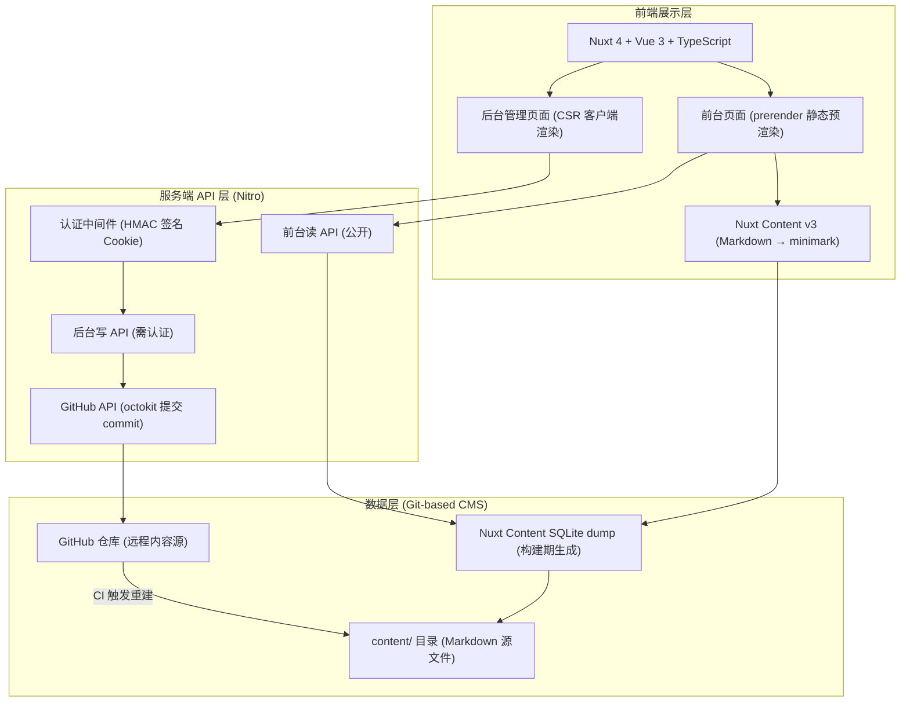
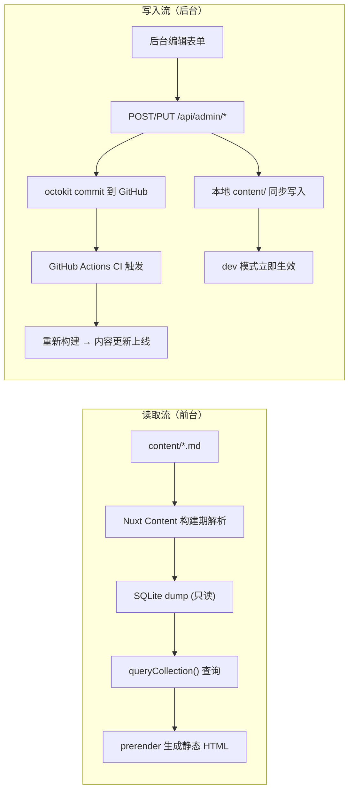
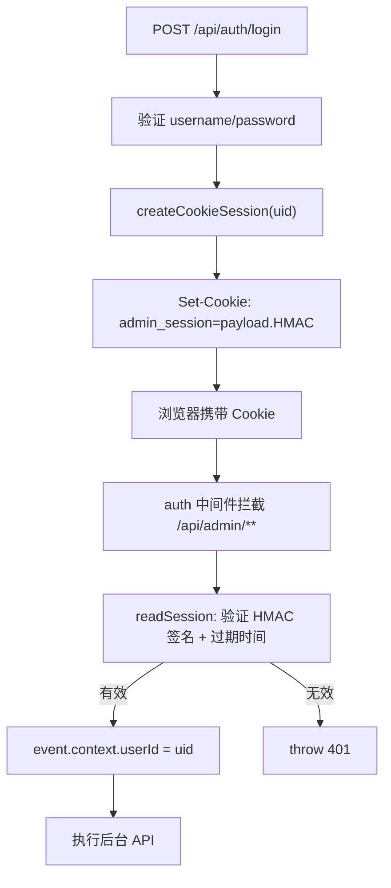

## 1. 架构设计



## 2. 技术描述

- **前端框架**：Nuxt 4 + Vue 3 + TypeScript
- **UI 层**：Vue 3 Composition API + `<script setup lang="ts">`
- **内容管理**：@nuxt/content v3（Markdown 驱动，构建期生成 SQLite dump，运行期只读）
- **内容写入**：GitHub API（octokit），后台编辑 → commit 到仓库 → CI 触发重建 → 内容更新
- **渲染策略**：
  - 前台页面：`prerender: true`（静态预渲染，构建时生成 HTML）
  - 后台页面：`ssr: false`（纯客户端渲染，避免 SSR cookie 转发竞态）
- **样式方案**：原生 CSS + CSS 自定义属性（Design Tokens）+ CSS Modules
- **服务端**：Nitro（Nuxt 内置）
- **数据库**：Nuxt Content 内置 SQLite（Node.js 原生 `node:sqlite` 连接器，无需 better-sqlite3 编译）
- **认证方式**：自建 HMAC 签名 Cookie 会话（`payload.HMAC`，无需服务端存储）
- **包管理**：pnpm 11.24.0（通过 corepack 激活，配置在 `pnpm-workspace.yaml`）
- **部署方式**：Docker Compose 多阶段构建，Node.js 26-alpine 基础镜像

## 3. 目录结构

```
project-root/
├─ app/                             # Nuxt srcDir
│  ├─ app.vue
│  ├─ pages/
│  │  ├─ index.vue                  # 首页
│  │  ├─ works/
│  │  │  ├─ index.vue               # 作品列表
│  │  │  └─ [slug].vue              # 作品详情
│  │  ├─ journal/
│  │  │  ├─ index.vue               # 日志列表
│  │  │  └─ [slug].vue              # 日志详情
│  │  ├─ about.vue                  # 关于页
│  │  └─ admin/
│  │     ├─ login.vue               # 后台登录
│  │     ├─ index.vue               # 仪表盘
│  │     ├─ works/
│  │     │  ├─ index.vue            # 作品管理列表
│  │     │  ├─ new.vue              # 新建作品
│  │     │  └─ [id].vue             # 编辑作品
│  │     └─ journal/
│  │        ├─ index.vue            # 日志管理列表
│  │        ├─ new.vue              # 新建日志
│  │        └─ [id].vue             # 编辑日志
│  ├─ components/
│  │  ├─ SiteHeader.vue
│  │  ├─ SiteFooter.vue
│  │  ├─ WorkCard.vue
│  │  ├─ WorkGallery.vue
│  │  ├─ JournalCard.vue
│  │  └─ AdminLayout.vue
│  ├─ layouts/
│  │  └─ default.vue
│  ├─ composables/
│  │  └─ useAuth.ts                 # 认证状态（全局 ref + checkAuth）
│  ├─ assets/
│  │  └─ css/
│  │     ├─ tokens.css              # 设计变量
│  │     ├─ globals.css             # 全局样式
│  │     └─ typography.css          # 排版系统
│  ├─ types/
│  │  └─ index.ts                   # 前端类型定义
│  └─ utils/
│     └─ format.ts
├─ content/                         # Nuxt Content 内容目录
│  ├─ works/                        # 作品 Markdown 文件
│  │  ├─ walnut-box-01.md
│  │  ├─ ceramic-cup-01.md
│  │  └─ natural-dye-scarf-01.md
│  └─ journal/                      # 日志 Markdown 文件
│     ├─ thoughts-on-woodworking.md
│     └─ wood-firing-log.md
├─ content.config.ts                # Nuxt Content collection 定义 + Zod schema
├─ server/
│  ├─ api/
│  │  ├─ auth/
│  │  │  ├─ login.post.ts           # 登录
│  │  │  ├─ logout.post.ts          # 登出
│  │  │  └─ session.get.ts          # 会话检查
│  │  ├─ works/                     # 前台公开读 API
│  │  │  ├─ index.get.ts            # 作品列表
│  │  │  └─ [slug].get.ts           # 作品详情
│  │  ├─ journal/                   # 前台公开读 API
│  │  │  ├─ index.get.ts            # 日志列表
│  │  │  └─ [slug].get.ts           # 日志详情
│  │  └─ admin/                     # 后台写 API（需认证）
│  │     ├─ works/
│  │     │  ├─ index.get.ts         # 作品管理列表
│  │     │  ├─ index.post.ts        # 新建作品
│  │     │  ├─ [id].get.ts          # 编辑回显
│  │     │  ├─ [id].put.ts          # 更新作品
│  │     │  └─ [id].delete.ts       # 删除作品
│  │     └─ journal/
│  │        ├─ index.get.ts
│  │        ├─ index.post.ts
│  │        ├─ [id].get.ts
│  │        ├─ [id].put.ts
│  │        └─ [id].delete.ts
│  ├─ middleware/
│  │  └─ auth.ts                    # 认证中间件（拦截 /api/admin/**）
│  └─ utils/
│     ├─ session.ts                  # HMAC 签名 Cookie 会话
│     ├─ query.ts                    # Nuxt Content 查询封装
│     └─ github.ts                  # GitHub API commit 封装
├─ shared/
│  └─ types.ts                      # 前后端共享类型
├─ public/
│  └─ favicon.svg
├─ .github/
│  └─ workflows/
│     └─ deploy.yml                  # CI：push → 构建 → 部署
├─ nuxt.config.ts
├─ content.config.ts
├─ package.json                     # packageManager: pnpm@11.24.0
├─ pnpm-workspace.yaml              # pnpm 11 配置（allowBuilds、shamefullyHoist 等）
├─ pnpm-lock.yaml
├─ .npmrc                            # 镜像源
├─ Dockerfile                        # 多阶段构建
├─ docker-compose.yml                # 容器编排
├─ .env.example                      # 环境变量模板
└─ tsconfig.json
```

## 4. 路由定义

| 路由 | 用途 | 渲染方式 |
|------|------|----------|
| `/` | 首页 | prerender (SSG) |
| `/works` | 作品列表 | prerender (SSG) |
| `/works/[slug]` | 作品详情 | prerender (SSG) |
| `/journal` | 日志列表 | prerender (SSG) |
| `/journal/[slug]` | 日志详情 | prerender (SSG) |
| `/about` | 关于页 | prerender (SSG) |
| `/admin/login` | 后台登录 | CSR |
| `/admin` | 后台仪表盘 | CSR (需认证) |
| `/admin/works` | 作品管理列表 | CSR (需认证) |
| `/admin/works/new` | 新建作品 | CSR (需认证) |
| `/admin/works/[id]` | 编辑作品 | CSR (需认证) |
| `/admin/journal` | 日志管理列表 | CSR (需认证) |
| `/admin/journal/new` | 新建日志 | CSR (需认证) |
| `/admin/journal/[id]` | 编辑日志 | CSR (需认证) |

## 5. API 定义

### 5.1 认证接口

```typescript
// POST /api/auth/login
interface LoginRequest {
  username: string
  password: string
}
interface LoginResponse {
  success: boolean
  user: { id: number; username: string }
}

// POST /api/auth/logout
interface LogoutResponse { success: boolean }

// GET /api/auth/session
interface SessionResponse { authenticated: boolean }
```

### 5.2 前台读 API（公开）

```typescript
// GET /api/works?page=1&limit=100&category=wood
interface WorksListResponse {
  items: Work[]
  total: number
  page: number
  limit: number
}

// GET /api/works/[slug]
// Response: Work（含 body: minimark 格式）

// GET /api/journal?page=1&limit=100
interface JournalListResponse {
  items: Journal[]
  total: number
  page: number
  limit: number
}

// GET /api/journal/[slug]
// Response: Journal（含 body: minimark 格式）
```

### 5.3 后台写 API（需认证）

```typescript
// GET    /api/admin/works?page=1&limit=10&status=all
// POST   /api/admin/works               // 新建 → GitHub commit + 本地写入
// GET    /api/admin/works/[id]           // 编辑回显
// PUT    /api/admin/works/[id]           // 更新 → GitHub commit + 本地写入
// DELETE /api/admin/works/[id]           // 删除 → GitHub commit + 本地删除

// GET    /api/admin/journal?page=1&limit=10&status=all
// POST   /api/admin/journal
// GET    /api/admin/journal/[id]
// PUT    /api/admin/journal/[id]
// DELETE /api/admin/journal/[id]
```

## 6. 数据模型

### 6.1 Content Collection Schema（content.config.ts）

内容以 Markdown frontmatter + 正文形式存储在 `content/` 目录，由 Nuxt Content 在构建期解析为 SQLite dump。

```typescript
// content.config.ts
export const collections = {
  works: defineCollection({
    type: 'page',
    source: 'works/**/*.md',
    schema: z.object({
      id: z.number(),
      title: z.string(),
      slug: z.string(),
      date: z.string(),
      category: z.enum(['wood', 'ceramics', 'textile', 'paper', 'metal', 'other']),
      cover: z.string().default(''),
      excerpt: z.string().default(''),
      materials: z.array(z.string()).default([]),
      tools: z.array(z.string()).default([]),
      gallery: z.array(z.string()).default([]),
      featured: z.boolean().default(false),
      status: z.enum(['draft', 'published']).default('published'),
      createdAt: z.string(),
      updatedAt: z.string()
    })
  }),
  journal: defineCollection({
    type: 'page',
    source: 'journal/**/*.md',
    schema: z.object({
      id: z.number(),
      title: z.string(),
      slug: z.string(),
      date: z.string(),
      cover: z.string().default(''),
      excerpt: z.string().default(''),
      status: z.enum(['draft', 'published']).default('published'),
      createdAt: z.string(),
      updatedAt: z.string()
    })
  })
}
```

### 6.2 TypeScript 类型（shared/types.ts）

```typescript
interface Work {
  id: number
  title: string
  slug: string
  date: string
  category: string
  cover: string
  excerpt: string
  materials: string[]
  tools: string[]
  process: string      // 前台渲染时从 body (minimark) 提取
  gallery: string[]
  featured: boolean
  status: 'draft' | 'published'
  createdAt: string
  updatedAt: string
}

interface Journal {
  id: number
  title: string
  slug: string
  date: string
  cover: string
  excerpt: string
  content: string      // 前台渲染时从 body (minimark) 提取
  status: 'draft' | 'published'
  createdAt: string
  updatedAt: string
}
```

### 6.3 Markdown 文件结构示例

```markdown
---
id: 1001
title: 胡桃木收纳盒
slug: walnut-box-01
date: '2026-03-15'
category: wood
cover: ''
excerpt: 选用北美黑胡桃木制作的收纳盒
materials:
  - 北美黑胡桃木
  - 天然木蜡油
tools:
  - 台锯
  - 带锯
gallery: []
featured: true
status: published
createdAt: '2026-03-15T00:00:00Z'
updatedAt: '2026-03-15T00:00:00Z'
---

## 选材

选择了纹理优美的北美黑胡桃木作为原料...

## 制作过程

1. 开料：将木板切割成所需尺寸
2. 开榫：使用榫卯结构连接四边
3. 打磨：从 80 目到 600 目逐级打磨
```

## 7. 数据流架构



## 8. 认证架构



- **签名方式**：HMAC-SHA256，密钥来自 `runtimeConfig.sessionSecret`
- **Cookie 格式**：`base64url({uid, exp}).base64url(HMAC)`
- **有效期**：7 天
- **中间件**：`server/middleware/auth.ts` 拦截所有 `/api/admin/**` 路径

## 9. 部署架构

```mermaid
flowchart TD
  subgraph "构建期"
    B1["Dockerfile 多阶段构建"] --> B2["pnpm install --frozen-lockfile"]
    B2 --> B3["pnpm run build (Nuxt + Content SQLite dump)"]
    B3 --> B4["node:26-alpine 运行镜像"]
  end

  subgraph "运行期"
    R1["Docker Compose"] --> R2["Node.js 服务 (port 3000)"]
    R2 --> R3["前台: 静态 HTML + SQLite dump"]
    R3 --> R4["后台: CSR + GitHub API 写入"]
  end

  subgraph "CI/CD"
    C1["GitHub Actions"] --> C2["push 触发"]
    C2 --> C3["构建 Docker 镜像"]
    C3 --> C4["部署到服务器"]
  end
```



### 环境变量

| 变量 | 用途 | 默认值 |
|------|------|--------|
| `ADMIN_USERNAME` | 管理员用户名 | `admin` |
| `ADMIN_PASSWORD` | 管理员密码 | `admin` |
| `SESSION_SECRET` | HMAC 签名密钥 | 开发兜底值 |
| `GITHUB_TOKEN` | GitHub API token（写内容） | — |
| `GITHUB_OWNER` | 仓库 owner | — |
| `GITHUB_REPO` | 仓库名 | — |
| `GITHUB_BRANCH` | 提交分支 | `main` |
| `GITHUB_API_BASE` | GitHub API 反代地址（国内） | 空（走官方） |
| `NPM_REGISTRY` | pnpm 镜像源 | `https://registry.npmmirror.com` |

## 10. 关键设计决策

| 决策 | 原因 |
|------|------|
| 前台 `prerender: true` | 内容在构建时确定，静态 HTML 利于 CDN 分发和 SEO |
| 后台 `ssr: false` (CSR) | 避免 SSR cookie 转发竞态，后台不需要 SEO |
| Nuxt Content 原生 SQLite 连接器 | 跳过 better-sqlite3 原生编译，Node 26 内置 `node:sqlite` 更稳定 |
| HMAC 签名 Cookie（无服务端存储） | 轻量、无状态，适合单容器部署，无需 Redis/数据库 |
| GitHub API 写入内容 | Git-based CMS，内容变更有版本历史，CI 自动触发重建 |
| 本地文件同步写入 | dev 模式下立即生效，不依赖 GitHub 配置 |
| pnpm + corepack | 团队版本一致，`pnpm-workspace.yaml` 集中管理构建配置 |
| 国内网络加速 | Docker 镜像源、pnpm 镜像源、GitHub API 反代、DNS 优化 |
